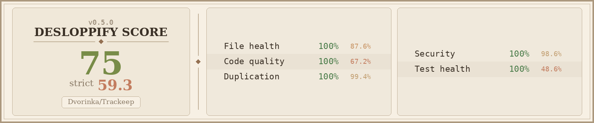

<p align="center">
  
</p>

<h1 align="center">
  Trackeep - Your Self-Hosted Productivity & Knowledge Hub
</h1>
<p align="center">
  Track, save, and organize everything that matters to you.
</p>

<p align="center">
  <a href="#quick-start">Quick Start</a>
  <span>&nbsp;&nbsp;•&nbsp;&nbsp;</span>
  <a href="#features">Features</a>
  <span>&nbsp;&nbsp;•&nbsp;&nbsp;</span>
  <a href="#tech-stack">Tech Stack</a>
  <span>&nbsp;&nbsp;•&nbsp;&nbsp;</span>
  <a href="#documentation">Documentation</a>
  <span>&nbsp;&nbsp;•&nbsp;&nbsp;</span>
  <a href="#contributing">Contributing</a>
</p>

<p align="center">
  
</p>

## Introduction

I built Trackeep because I was tired of juggling a dozen different apps for my digital life. You know how it is – bookmarks in one place, tasks in another, random notes scattered everywhere, and that great article you meant to read somewhere in your browser history.

So I decided to build my own solution. Trackeep is basically the app I wish I had – one place to store, organize, and track everything that matters to me. It's open-source and self-hosted because I believe your data should belong to you, not some corporation.

It's like if Papra, Notion, Pocket and a todo app had a baby. Built by one person (with AI's help), for anyone who's tired of their digital life being a mess.

### My Design Inspiration

I've always been a huge fan of **Papra** – their clean, minimalistic approach just makes sense. Everything feels intentional and puts your content first.

So yeah, Trackeep borrows heavily from that design philosophy. But I wrote every line of code from scratch – this isn't some copy-paste job. I took that beautiful simplicity and tried to expand it into more of a productivity and knowledge management tool.

### The AI-Assisted Journey

This project was built with **Windsurf SWE 1.5**.

Look, I'll be honest – I'm not the best coder out there. But I really wanted to build something that solves real problems, and I think passion matters more than being perfect. Windsurf helped me figure out the hard stuff, learn new technologies, and actually build something I'm proud of.

As a solo dev, having an AI pair programmer made this whole thing possible. Go backend, SolidJS frontend, React Native app – stuff I probably couldn't have tackled alone. It's pretty cool what you can create when humans and AI work together, even when you're still learning.

With Trackeep, everything you save is centralized, searchable, and easy to manage, while remaining self-hosted so you maintain full privacy and ownership – just as it should be.

## Project Status

Trackeep is my labor of love – constantly evolving with core functionalities that I use every day. As a solo developer, I'm building this in the open, adding features based on real needs and feedback from fellow digital wanderers. The platform includes multiple services working together to create the productivity hub I've always wanted.

Every feature you see is something I personally needed and use. Your feedback, bug reports, and feature ideas aren't just welcome – they're what help shape this tool into something that can help others organize their digital lives too.

## Features

### Core Functionality
- **Bookmarks & Link Management**: Save and categorize links, articles, videos, and web resources
- **Learning & Progress Tracking**: Track courses, tutorials, and personal learning paths
- **Task & To-Do Lists**: Plan future tasks, create checklists, and mark completed items
- **Media & File Storage**: Upload, store, and manage documents, presentations, images,... (just like Papra)
- **Notes & Annotations**: Add personal notes to saved links, files, or tasks
- **Tagging & Organization**: Assign multiple tags or categories for efficient sorting

### Advanced Features
- **AI-Powered Recommendations**: Intelligent content suggestions and organization
- **Integrated Messaging (V1)**: Discord-style conversations (self chat, DMs, groups, team channels, global channels), realtime updates, smart suggestions, deep-link references, encrypted password vault sharing, voice notes, and browser-local optional transcription/call signaling
- **OAuth Integration**: Secure authentication with GitHub and other providers
- **Mobile App**: Native React Native application for iOS and Android
- **Email Ingestion**: Send/forward emails to automatically import content
- **Content Extraction**: Automatically extract text from images or scanned documents
- **Smart Tagging Rules**: Automatically tag content based on custom rules
- **Full-Text Search**: Quickly search across all your content with advanced filtering
- **Dark Mode**: Beautiful dark theme for low-light environments
- **Responsive Design**: Works seamlessly on desktop, tablet, and mobile devices

### Privacy & Self-Hosting
- **Fully Self-Hosted**: No third-party servers required – everything runs on your own infrastructure
- **Data Ownership**: Your data remains yours – encrypted, controlled, and never leaves your systems
- **Open Source**: Transparent codebase you can audit, modify, and trust
- **API Access**: Build custom applications on top of Trackeep
- **AI Control**: Full control over which AI services (if any) you want to use

### AI Services (Optional & Configurable)

Trackeep includes AI features, but you're in complete control:

**Currently Integrated:**
- **LongCat AI** – For content recommendations, smart tagging, and text extraction
- **DeepSeek** – Advanced reasoning and content analysis capabilities
- **Mistral AI** – European AI with strong privacy focus
- **Grok (xAI)** – Real-time knowledge and witty responses
- **Ollama** – Self-hosted local AI models (run completely offline)
- **OpenAI Compatible** – Can be configured with any OpenAI-compatible API endpoint

**Your Options:**
- ✅ **Use all AI features** – Full experience with intelligent automation
- ✅ **Use specific AI services** – Enable only the features you want
- ✅ **Use only local AI** – Run completely offline with Ollama
- ✅ **Disable all AI** – Run Trackeep completely without any AI integration
- ✅ **Replace with your own** – Configure custom AI endpoints or self-hosted models

**A Note on AI Services & Privacy:**

Look, I want to be completely transparent with you. **DeepSeek and LongCat AI are Chinese companies**, and I totally get if that raises some concerns for you. Data privacy is serious business.

But here's my honest take: with the pricing they offer (especially DeepSeek's incredibly cheap API), I personally feel more comfortable giving my data to them than to ChatGPT at their prices. Plus, you're in complete control – you can disable any service you don't want, or stick to European options like Mistral, or even run everything locally with Ollama.

The beauty of Trackeep is that **you decide**. No hidden data collection, no forced AI usage – just transparent options that you control.

**Privacy First:**
- All AI processing happens through your configured endpoints
- No data sent to third-party services without your explicit configuration
- AI features can be completely disabled for maximum privacy
- Full transparency about what data is sent to AI services
- Local AI option with Ollama for complete offline privacy

**Example Configurations:**
```bash
# Disable all AI
DISABLE_AI=true

# Use only European AI (Mistral)
MISTRAL_API_KEY=your-key
DISABLE_LONGCAT=true
DISABLE_DEEPSEEK=true
DISABLE_GROK=true

# Use only local AI (Ollama)
OLLAMA_BASE_URL=http://localhost:11434
DISABLE_ALL_CLOUD_AI=true

# Budget-friendly setup (DeepSeek + LongCat)
DEEPSEEK_API_KEY=your-key
LONGCAT_API_KEY=your-key
DISABLE_OPENAI=true
DISABLE_MISTRAL=true
DISABLE_GROK=true

# Privacy-focused setup (Mistral + Ollama)
MISTRAL_API_KEY=your-key
OLLAMA_BASE_URL=http://localhost:11434
DISABLE_CHINESE_AI=true
```

## Tech Stack

### Frontend
- **SolidJS + TypeScript** – Modern, reactive UI framework with fine-grained reactivity
- **Vite** – Fast build tool and development server with HMR
- **@kobalte/core** – High-quality, accessible component primitives
- **@tanstack/solid-query** – Powerful data fetching and state management
- **@solidjs/router** – Built-in routing solution for SPAs
- **UnoCSS** – Instant, atomic CSS engine with Tailwind compatibility
- **@tabler/icons** – Comprehensive, open-source icon set
- **Theme Color**: `#39b9ff` (Go-inspired bright blue accent)

### Backend Services
- **Main Backend (Go)** – Core API, data management, and business logic
  - Gin web framework for HTTP routing
  - GORM for database operations
  - JWT authentication
  - OAuth2 integration
- **OAuth Service (Go)** – Dedicated authentication service
  - GitHub OAuth integration
  - JWT token management
- **Database** – PostgreSQL for production, SQLite for development

### Mobile Application
- **React Native** – Cross-platform mobile development
- **React Navigation** – Navigation and routing
- **React Native Paper** – Material Design components
- **SQLite Storage** – Local data persistence
- **Camera & Vision** – Document scanning capabilities

### DevOps & Deployment
- **Docker & Docker Compose** – Containerized deployment
- **GitHub Actions** – CI/CD pipeline
- **Multi-service Architecture** – Microservices for scalability

## Quick Start

### Prerequisites
- Docker and Docker Compose
- Git

### Installation with Docker (Recommended)

1. **Clone the repository**
   ```bash
   git clone https://github.com/Dvorinka/Trackeep.git
   cd Trackeep
   ```

2. **Configure environment**
   ```bash
   cp .env.example .env
   # Edit .env with your configuration
   ```

3. **Start all services**
   ```bash
   # Using the startup script
   ./start.sh
   
   # Or manually with Docker Compose
   docker compose up -d
   ```

4. **Access the application**
   - Frontend: http://localhost:5173
   - Backend API: http://localhost:8080
   - Health Check: http://localhost:8080/health

### Docker Updates (Easy Way)

Trackeep now supports automatic Docker updates! Instead of rebuilding from source, you can pull pre-built images:

#### **Method 1: Quick Update Script**
```bash
./update.sh
```

#### **Method 2: Using Published Images**
```bash
docker compose -f docker-compose.published.yml pull
docker compose -f docker-compose.published.yml up -d
```

#### **Method 3: Manual Pull**
```bash
docker pull ghcr.io/Dvorinka/trackeep/backend:latest
docker pull ghcr.io/Dvorinka/trackeep/frontend:latest
docker compose up -d
```

### Available Docker Images

Pre-built images are automatically published to GitHub Container Registry:
- `ghcr.io/Dvorinka/trackeep/backend:latest`
- `ghcr.io/Dvorinka/trackeep/frontend:latest`

**Benefits:**
- 🚀 **Faster updates** - No need to build from source
- 🔄 **Automatic builds** - Images published on every push to main
- 📦 **Version control** - Images tagged with commit SHAs and branches
- 🛡️ **Stable releases** - Tested images ready for production

### Demo Login
- Email: `demo@trackeep.com`
- Password: `password`

## Development

### Project Structure
```
trackeep/
├── backend/              # Main Go backend service
│   ├── handlers/         # HTTP handlers
│   ├── models/          # Data models
│   ├── middleware/      # HTTP middleware
│   ├── services/        # Business logic services
│   ├── utils/           # Utility functions
│   └── config/          # Configuration files
├── frontend/             # SolidJS frontend application
├── mobile-app/           # React Native mobile application
├── docs/                 # Documentation
├── scripts/              # Utility scripts
├── data/                 # Data storage directory
├── uploads/              # File upload directory
├── docker-compose.yml    # Multi-service orchestration
├── docker-compose.prod.yml # Production configuration
├── start.sh             # Startup script
└── README.md
```

### Local Development

```bash
# Backend
cd backend
go mod download
go run main.go

# Frontend
cd frontend
npm install
npm run dev

# Mobile App
cd mobile-app
npm install
npm run start
```

## Documentation

Comprehensive documentation is available in the `/docs` directory:

- **[User Guide](./docs/USER_GUIDE.md)** – Complete user documentation
- **[API Documentation](./docs/API.md)** – REST API reference
- **[AI Assistant Features](./docs/AI_ASSISTANT.md)** – AI-powered features guide

Additional documentation files:
- **[Development Guide](./docs/DEVELOPMENT.md)** – Development setup and guidelines
- **[Features Roadmap](./docs/FEATURES_ROADMAP.md)** – Planned features and improvements
- **[Security Analysis](./docs/SECURITY_ANALYSIS.md)** – Security considerations and best practices

## Configuration

### Environment Variables

Key environment variables to configure:

```bash
# Server Configuration
PORT=8080
FRONTEND_PORT=5173
GIN_MODE=debug

# Database Configuration
DB_TYPE=sqlite
DB_HOST=localhost
DB_PORT=5432
DB_USER=trackeep
DB_PASSWORD=your_password_here
DB_NAME=trackeep
DB_SSL_MODE=disable

# SQLite (for development)
SQLITE_DB_PATH=./trackeep.db

# JWT Configuration
# JWT_SECRET is auto-generated on startup and stored in jwt_secret.key
# You can override by setting JWT_SECRET environment variable if needed
JWT_EXPIRES_IN=24h

# Encryption Configuration
# ENCRYPTION_KEY is auto-generated on startup and stored in encryption.key
# You can override by setting ENCRYPTION_KEY environment variable if needed

# File Upload Configuration
UPLOAD_DIR=./uploads
MAX_FILE_SIZE=10485760

# CORS Configuration
CORS_ALLOWED_ORIGINS=http://localhost:5173,http://localhost:3000

# SMTP Configuration for Password Reset
SMTP_HOST=smtp.gmail.com
SMTP_PORT=587
SMTP_USERNAME=your_email@gmail.com
SMTP_PASSWORD=your_app_password
SMTP_FROM_EMAIL=your_email@gmail.com
SMTP_FROM_NAME=Trackeep

# Demo Mode Configuration
VITE_DEMO_MODE=false

# AI Services (All Optional)
# Chinese AI Services (Budget-friendly)
LONGCAT_API_KEY=your_longcat_api_key_here
LONGCAT_BASE_URL=https://api.longcat.chat
DEEPSEEK_API_KEY=your_deepseek_api_key_here
DEEPSEEK_BASE_URL=https://api.deepseek.com

# Western AI Services
MISTRAL_API_KEY=your_mistral_api_key_here
MISTRAL_MODEL=mistral-small-latest
GROK_API_KEY=your_grok_api_key_here
OPENAI_API_KEY=your_openai_api_key_here
OPENAI_BASE_URL=https://api.openai.com

# Local AI (Complete Privacy)
OLLAMA_BASE_URL=http://localhost:11434

# AI Control (Disable what you don't want)
DISABLE_AI=false
DISABLE_LONGCAT=false
DISABLE_DEEPSEEK=false
DISABLE_MISTRAL=false
DISABLE_GROK=false
DISABLE_OPENAI=false
DISABLE_CHINESE_AI=false
DISABLE_ALL_CLOUD_AI=false

# OAuth Configuration
GITHUB_CLIENT_ID=your_github_client_id
GITHUB_CLIENT_SECRET=your_github_client_secret
```

**AI Configuration Notes:**
- All AI services are optional – Trackeep works perfectly without any AI
- Mix and match services based on your budget and privacy preferences
- Chinese AI services (DeepSeek, LongCat) offer great pricing but consider your privacy needs
- European option (Mistral) for GDPR-compliant AI processing
- Local AI (Ollama) for complete offline privacy
- Custom endpoints supported for maximum flexibility

## Contributing

Building Trackeep as a solo developer has been an incredible journey, but it's always better when we build together! Whether you're fixing a typo, adding a feature, or just sharing ideas – your contribution matters.

**Feel free to contribute and enhance it to your liking. Help me make this project successful!**

Every contribution, no matter how small, helps turn this solo dream into a community success story. Whether you're a seasoned developer or just starting out, your perspective and skills can help make Trackeep better for everyone.

Here's how you can join this adventure:

1. **Fork the repository** and make it your own
2. **Create a feature branch** (`git checkout -b feature/amazing-feature`)
3. **Commit your changes** (`git commit -m 'Add some amazing feature'`)
4. **Push to the branch** (`git push origin feature/amazing-feature`)
5. **Open a Pull Request** – I'll be excited to review it!

### Development Guidelines
- Follow Go coding standards for backend services
- Use TypeScript for frontend development  
- Write tests for new features (helps future you!)
- Update documentation as needed
- Remember: this is a labor of love, so let's keep it fun and welcoming

Don't hesitate to reach out if you're new to contributing – we all started somewhere, and I'm happy to help you get started!

## License

This project is licensed under the GNU General Public License v3.0 - see the [LICENSE](LICENSE) file for details.

**Important Note:** Commercial exploitation of this software or derivatives is prohibited without explicit permission from the copyright holder. If you're interested in commercial use, please contact info@tdvorak.dev for licensing options.

## Community & Support

- **Issues**: Use GitHub Issues for bug reports and feature requests
- **Discussions**: Use GitHub Discussions for questions and community support
- **Documentation**: Check the `/docs` directory for comprehensive guides

## Acknowledgements

### Inspiration
- **[Papra](https://github.com/papra-hq/papra)** – Heavy design inspiration for the UI/UX approach
- **[Paperless-ngx](https://paperless-ngx.com/)** – Document management concepts
- **[Notion](https://notion.so)** – Productivity and knowledge management features
- **[Pocket](https://getpocket.com)** – Content saving and organization ideas

### Technology Stack
This project is built with amazing open-source technologies:
- **Frontend**: SolidJS, UnoCSS, Kobalte, TanStack Query
- **Backend**: Go, Gin, GORM, PostgreSQL
- **Mobile**: React Native, React Navigation
- **DevOps**: Docker, GitHub Actions


## A Personal Note

Thank you for taking the time to look at my project. Trackeep represents months of learning, building, and dreaming – all in the service of creating something that makes our digital lives a little more organized and a lot more meaningful.

In a world of endless subscriptions and data-hungry platforms, I believe there's beauty in owning your digital garden. Trackeep is my attempt to plant those seeds.

Whether you use it, contribute to it, or just find inspiration here – know that you're part of something special. A solo developer's dream, powered by AI assistance, and shared with the open-source community.

---

**Trackeep** – Built with ❤️ by one human, one AI, and a dream of better digital organization.
